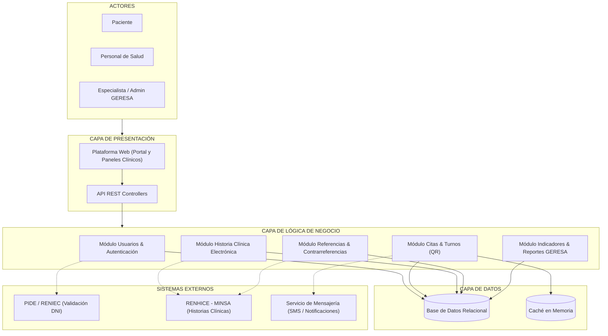

# Arquitectura Inicial del Sistema - Hampi Ayacucho

## 1. Organización en Tres Capas
- **Capa de Presentación:** Plataforma web unificada (Portal Pacientes y Paneles Clínicos/GERESA) comunicándose con los controladores de una API REST.
- **Capa de Lógica de Negocio:** Procesa las reglas mediante módulos de Usuarios (2FA), Citas y Turnos (QR), Historia Clínica Electrónica, Referencias y Reportes.
- **Capa de Datos:** Persistencia relacional junto con una capa de aceleración con caché en memoria.
- **Sistemas Externos:** Integración con RENHICE (MINSA), PIDE (RENIEC) y servicios de mensajería (SMS/Email).

---

## 2. Diagrama de Arquitectura

